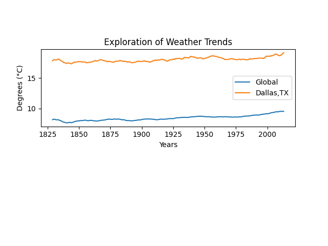

# Project 1: Explore Weather Trends

In this project, we will analyze local and global temperature data and compare the temperature trends where you live to overall global temperature trends.

## Getting Started

These instructions will get you a copy of the project up and running on your local machine for development and testing purposes.

### Prerequisites

* [git](https://git-scm.com/book/en/v2/Getting-Started-Installing-Git)
* [ssh key](https://docs.github.com/en/enterprise/2.15/user/articles/adding-a-new-ssh-key-to-your-github-account)
* [python 3](https://realpython.com/installing-python/)
* [poetry](https://python-poetry.org/docs/)
* [pandoc](https://pandoc.org/installing.html)

### Installing

```
cd project_1_explore_weather_trends

poetry install

poetry run python explore_weather_trends.py --global_weather ./data/global_weather_trends.csv --local_weather ./data/dallas_weather_trends.csv --local_city Dallas --rolling_average 10

pandoc README.md -s -o /tmp/exploration_of_weather_trends.pdf

```

### Data Collection
Data was collected from thee database to produce two different datasets (ie. local and global weather).

Global Weather Trend Data:
```sql
select avg_temp, year from global_data
```

Local Dallas, TX Weather Trend Data:
```sql
select cd.city, cd.country, cd.avg_temp, cd.year
from city_data as cd
join city_list as cl on cl.city = cd.city
where cl.city = 'Dallas' and cl.country = 'United States'
```

### Data Manipulation
Python was used to manipulate the data.  Utilizing Python modules such as pandas and numpy were used to manipulate the data to get it in the proper format for presenting the data.  Below is a snippet how the rolling averages were produced.

```python
rolling_average = 10
weather = pd.read_csv(weather_file)
weather["avg_temp"].rolling(rolling_average).mean()
```

### Data Observations/Visualization
The following observations show how the data in Figure 1 describes the differences in weather trends globally and locally in Dallas, TX (Figure 1).  Python's matplotlib library was used to visualize the results.



Exploration:

* The weather in Dallas, TX is hotter on average than the global average. Even though global weather trends have been measured since 1750 and Dallas weather trends since 1820, the differences have been consistent over time.

* The global average temperature between 1820 and 2013 was 8.47 degrees (°C).  However, the local Dallas, TX average temperature between 1820 and 2013 was 18.07 degrees (°C).  As a result, Dallas, TX is approximately 9.6 degrees (°C) warmer on average than the rest of the world.  
 
* Furthermore, the global average temperature differences has incrementally increased 0.01 degrees (°C) every 10 years during the aformentioned time frame.  On the other hand, locally Dallas, TX average temperature differences have increased 0.02 degrees (°C) every 10 years. 

* The overall trending based on the data and charts show the world is getting hotter showing this trend has been consistent over the last few centuries.


## Authors

* **Larry Johnson**

